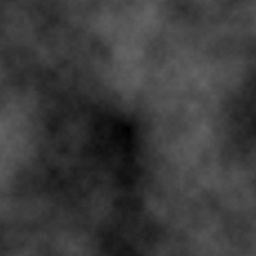
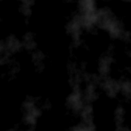
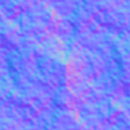
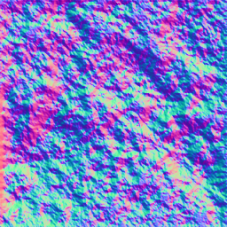
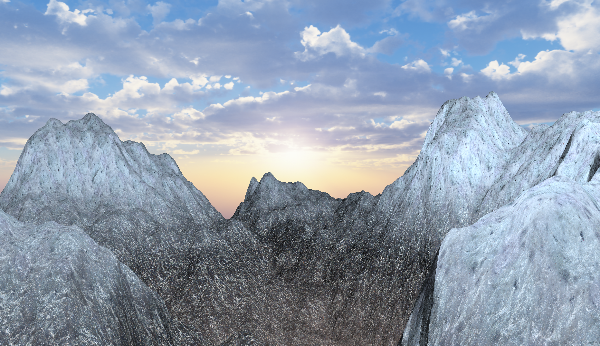
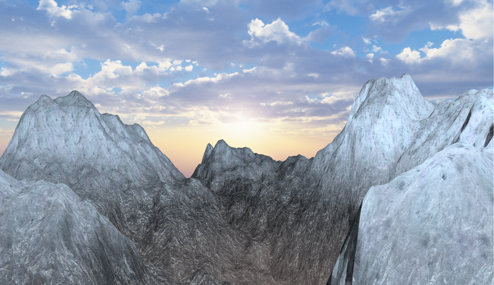
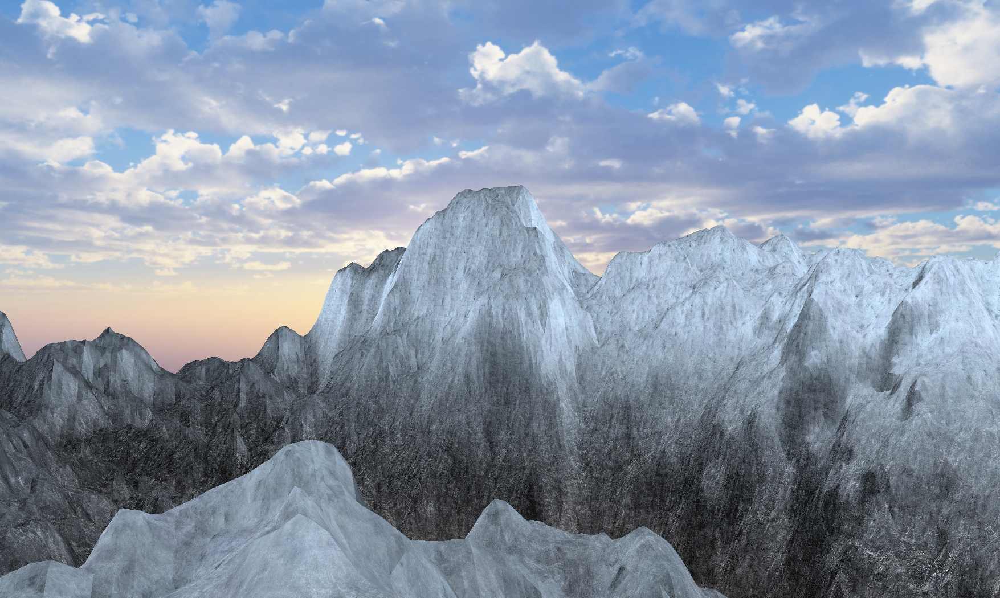
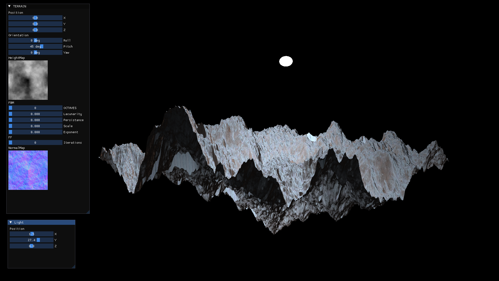
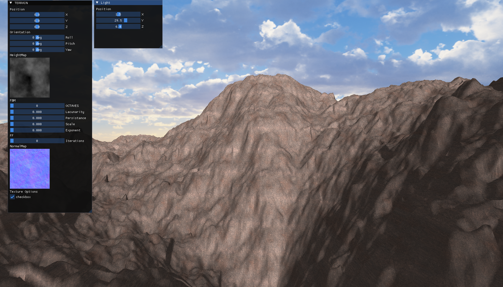
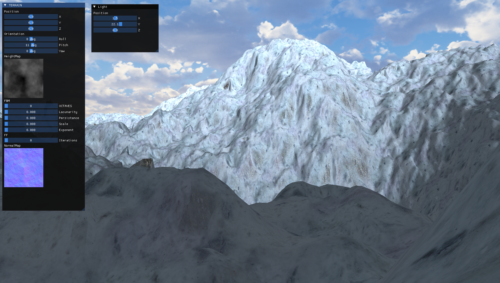

# TERRAIN_GENERATION

This project focuses on creating procedural terrain generation
using multiple height map techniques.
The goal is to produce diverse and realistic landscapes by combining 
different methods to simulate natural terrain features.

## Features

- Procedural HeightMap generation with:
    - Fault Formation
    - Fractal Brownian Noise
    - Midpoint Displacemant

- Procedural NormalMap generation with:
    - Sobel Operator
    - Scharr Operator
    - Prewitt Operator

- LOD with tessellation shaders based on distance

- Height based texture blending

- Triplanar texture mapping

- Texture Bombing

- PBR

## HeightMap Generation

### Fault Formation

This technique works by randomly generating a line on the height maps at each iteration and then setting a random 
altitude on one side of the fault line.

| FF16 | FF32 | FF64 |
|---|---|---|
|   | |   |

This is not the end of the algorithm, as it is necessary 
to smooth the edges created by the lines. 
In the original source, this is done by processing 
the height map in strips and adjusting the 
altitude values based on the previous ones. 
However, since I used compute shaders,
this sequential approach would not have worked, 
so I opted for applying a blur filter over the height map.

With mean filter:

| FF16 | FF32 | FF64 |
|---|---|---|
|   | |   |

### Midpoint Displacemant
....

### Fractal Brownian Noise

| Value | Perlin |
|---|---|
|   | | 

## NormalMap Generation

To generate normals, I create normal maps directly from 
height maps using convolution kernels. 
These 3x3 matrices are convolved with the image 
to calculate the pixel intensity gradients, 
typically used for edge detection. 
Here, I calculate the gradient for each pixel, 
corresponding to the surface normals, via
compute shader in parallel.

### Prewitt Operator

The Prewitt operator uses uniform weights for differentiation. 
It is less robust against noise, which can lead to results that
 are more sensitive to unwanted local variations in the height map.

$$
G_x = \begin{bmatrix}
-1 & 0 & 1 \\
-1 & 0 & 1 \\
-1 & 0 & 1
\end{bmatrix}, \quad
G_y = \begin{bmatrix}
-1 & -1 & -1 \\
 0 &  0 &  0 \\
1 & 1 & 1
\end{bmatrix}
$$

### Sobel Operator

The Sobel operator uses weighted smoothing to reduce noise 
and achieve sharper edges. It applies higher weights to the 
central pixels, which helps reduce the impact of noise.

$$
G_x = \begin{bmatrix}
1 & 0 & 1 \\
2 & 0 & 2 \\
1 & 0 & 1
\end{bmatrix}, \quad
G_y = \begin{bmatrix}
1 & 2 & 1 \\
0 & 0 & 0 \\
1 & 2 & 1
\end{bmatrix}
$$

### Scharr Operator

The Scharr operator is an improved version of 
the Sobel operator, 
offering better approximations for fine details.

$$
G_x = \begin{bmatrix}
3 & 0 & 3 \\
10 & 0 & 10 \\
3 & 0 & 3
\end{bmatrix}, \quad
G_y = \begin{bmatrix}
3 & 10 & 3 \\
0 & 0 & 0 \\
3 & 10 & 3
\end{bmatrix}
$$

| Prewitt | Sobel | Scharr |
|---|---|---|
|   | |   |

## LOD with tessellation shaders based on distance

## Texture Blending

## Triplanar Texture Mapping

Triplanar Texture Mapping is a an alternative to the basic UV mapping. 
It projects the texture onto the terrain model from three different 
planes (X, Y, and Z axes) and blends the results together. This offers a more
natural look to my terrain.

| TTM Off | TTM On | 
|---|---|
|   | | 

## Texture Bombing

Texture Bombing is a method for reducing the tiling effect
of a texture. The idea is usually to sample the texture 
from multiple locations with different scales, 
orientations, or blending. I implemented a variation 
that simulates a form of Voronoi pattern. 
It works by considering the texture as a grid, 
and for each grid cell we sample from, we also sample 
from all 8 surrounding cells and blend them proportionally 
to their distance from the center cell.

| Bombing Off | Bombing On | 
|---|---|
|   | | 

## Note on Texturing and Performance

Even though I achieved a pretty pleasant result, the usage of 
both triplanar texturing and texture bombing resulted in 
a performance hit. This is because, compared to simple UV texturing, 
where I would only sample the textures once, now with 3 
samples from triplanar texturing and 9 more from texture bombing, 
I sample 60 times per material (albedo, AO, normal, roughness
and metallic).

# Some of the first results

# References

- Focus On 3D Terrain Programming by Trent Polack.
- GPU Gems (Chapter 20) by Nvidia