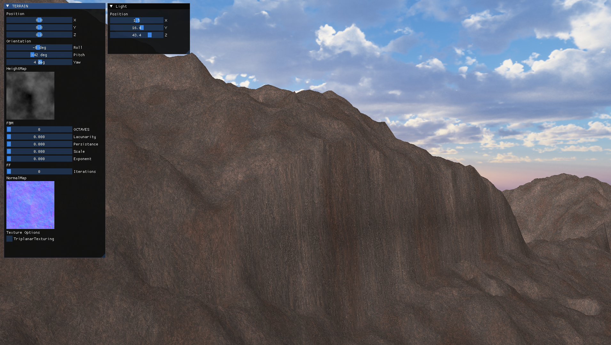
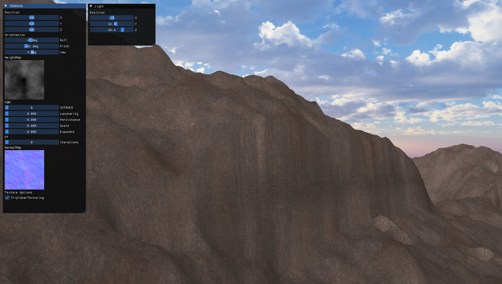

# TERRAIN_GENERATION

This project focuses on creating procedural terrain generation
using multiple height map techniques.
The goal is to produce diverse and realistic landscapes by combining 
different methods to simulate natural terrain features.

## Features

- Procedural HeightMap generation with:
    - Fault Formation
    - Fractal Brownian Noise
    - Midpoint Displacemant

- Procedural NormalMap generation with:
    - Sobel Operator
    - Scharr Operator
    - Prewitt Operator

- Triplanar texture mapping

- Texture Bombing

- Slope and Height based texture blending

- PBR

- LOD with tessellation shaders based on roughness

## HeightMap Generation

### Fault Formation

| FF16 | FF32 | FF64 |
|---|---|---|
|   | |   |
### Fractal Brownian Noise

## NormalMap Generation

## Triplanar Texture Mapping

Abrupt zone for better viewing of the effect:

| TTM Off | TTM On | 
|---|---|
|   | | 

# First Results

