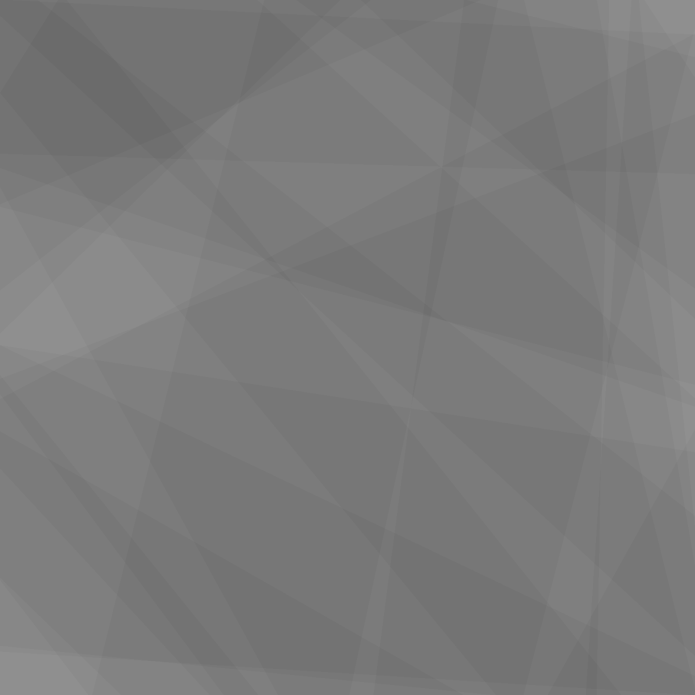

# TERRAIN_GENERATION

This project focuses on creating procedural terrain generation
using multiple height map techniques.
The goal is to produce diverse and realistic landscapes by combining 
different methods to simulate natural terrain features.

## Features

- Procedural HeightMap generation with:
    - Fault Formation
    - Fractal Brownian Noise

- Procedural NormalMap generation with:
    - Sobel Operator
    - Scharr Operator

- Triplanar texture mapping

- LOD with tessellation shaders based on roughness

## HeightMap Generation

### Fault Formation

| FF16 | FF32 | FF64 |
|---|---|---|
|   | |   |
### Fractal Brownian Noise

# First Result

